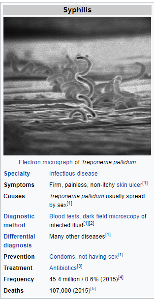

# Wikipedia Disease classification
This is a notebook to train a binary classifier to identiy whether a given wikipedia article describes a disease or not.

I have used Latent Dirichlet Allocation (LDA) to generate latent distribution of topics for the given dataset. Each document of the dataset is converted into a distribution of topics and each topic itself is a distribution of words in that topic. 
I used the topic distribution vectos as my features and trained a fully connected neural network with 3 hidden layers. 

And, to extract the attributes related to the disease I used the infobox of the wikipedia page to get as much information available.

Here's a sample infobox of wikipedia article about syphilis :




I used BeautifulSoup to extract the details from the HTML page.

Required Packages :
```
nltk
tensorflow==1.15.0
gensim
stop_words
bs4
wikipedia
numpy
```

## Build Model :
- Download the data from http://challenge.20n.com/machine-learning/training.tar.gz
- You can either run a detailed Jupyter notebook or run the script training.py.

## Run Test :
- Unzip the LDA Data 
- Then you can either run testing Jupyter notebook or run the script predict_page.py as :
```
python predict_page.py --page <wikipedia page name>
```

## Sample Output :
```
python predict_page.py --page syphilis

OUTPUT : {'causes': 'treponema pallidum usually spread by sex',
 'deaths': '107,000 (2015)',
 'diagnostic method': 'blood tests, dark field microscopy of infected fluid',
 'differential diagnosis': 'many other diseases',
 'disease name': 'Syphilis',
 'frequency': '45.4 million / 0.6% (2015)',
 'is disease': True,
 'prevention': 'condoms, not having sex',
 'specialty': 'infectious disease',
 'symptoms': 'firm, painless, non-itchy skin ulcer',
 'treatment': 'antibiotics'}

```
